# MyNotes — ASP.NET Core MVC Notes App

MyNotes is a full-stack note management web application built with **ASP.NET Core MVC** and **SQL Server**.

The project focuses on learning and implementing real-world backend concepts such as authentication, authorization, Entity Framework Core, CRUD operations, soft deletion, search, and secure user-specific data access.

---

## Features

### 🔐 Authentication & Authorization

* User registration and login
* Password hashing using BCrypt
* Cookie-based authentication
* Protected dashboard using `[Authorize]`
* User-specific data access
* Secure logout with anti-forgery protection


### 📊 Dashboard

* Total notes count
* Pinned notes count
* Trash count
* Pinned notes section
* Recent notes


### 📝 Note Management

* Create notes
* Edit notes
* Pin / Unpin notes
* Delete notes
* Track creation and update timestamps

### 🗑️ Trash System

* Soft delete notes instead of immediately removing them
* Restore deleted notes
* Permanently delete notes
* Bootstrap confirmation modal for permanent deletion


### 🔎 Search

* Search notes by Title or Content
* Server-side filtering using LINQ


### 🎨 UI

* Bootstrap-based responsive design
* Shared sidebar layout accross all pages
* Active navigation state
* Validation messages
* Success notifications using `TempData`

---

## 🛠️ Tech Stack

| Technology            | Purpose                      |
| --------------------- | ---------------------------- |
| ASP.NET Core MVC      | Web application framework    |
| C#                    | Backend programming language |
| Entity Framework Core | ORM / database access        |
| SQL Server            | Relational database          |
| Bootstrap             | UI styling                   |
| Razor Views           | Server-side HTML rendering   |
| BCrypt                | Password hashing             |
| Docker                | Running SQL Server           |
| Git & GitHub          | Version control              |

---

## 🏗️ Project Structure

```text
MyMvcApp/
│
├── Controllers/
│   ├── AuthController.cs
│   └── DashboardController.cs
│
├── Data/
│   └── AppDbContext.cs
│
├── Dto/
│   ├── LoginUserDto.cs
│   ├── RegisterUserDto.cs
│   └── CreateNoteDto.cs
│
├── Models/
│   ├── User.cs
│   └── Note.cs
│
├── Views/
│   ├── Auth/
│   │   ├── Login.cshtml
│   │   └── Register.cshtml
│   │
│   ├── Dashboard/
│   │   ├── Index.cshtml
│   │   ├── AllNotes.cshtml
│   │   ├── CreateNote.cshtml
│   │   ├── EditNote.cshtml
│   │   └── Trash.cshtml
│   │
│   └── Shared/
│       └── _Layout.cshtml
│
├── Migrations/
│
├── Program.cs
├── appsettings.json
└── MyMvcApp.csproj
```

---

## 🔒 Security

The application implements several security practices:

* Passwords are hashed using BCrypt.
* Cookie authentication is used for authenticated sessions.
* Dashboard actions require authentication.
* Notes are filtered by the authenticated user's `UserId`.
* Users cannot access another user's notes by changing the URL ID.
* Anti-forgery tokens protect POST requests.
* Database credentials are stored using **.NET User Secrets** during development.

---

## 🗄️ Database

The application uses **Microsoft SQL Server** with **Entity Framework Core**.

Main entities:

### User

```text
User
├── Id
├── Username
├── Email
└── PasswordHash
```

### Note

```text
Note
├── Id
├── Title
├── Content
├── CreatedAt
├── UpdatedAt
├── IsPinned
├── IsDeleted
└── UserId
```

Each note belongs to a specific user through `UserId`.

---

## 🐳 Running SQL Server with Docker

The project uses SQL Server running inside Docker.

Example container:

```bash
docker start sqlserver
```

If the container has not been created yet, create one using your own SQL Server credentials.

> Do not commit real database passwords or other secrets to GitHub.

---

## ▶️ Running the Application

### 1. Clone the repository

```bash
git clone git@github.com:injal123/aspnetcore-mvc-crud.git
cd aspnetcore-mvc-crud
```

### 2. Start SQL Server

```bash
docker start sqlserver
```

### 3. Configure User Secrets

The project uses .NET User Secrets for sensitive configuration.

Example:

```bash
dotnet user-secrets set "ConnectionStrings:DefaultConnection" "YOUR_CONNECTION_STRING"
```

Use your own credentials and never commit them.

### 4. Apply migrations

```bash
dotnet ef database update
```

### 5. Run the application

```bash
dotnet watch
```

The application will be available at the local URL shown by ASP.NET Core.

---

---

---

---


## 📸 Screenshots


### Starting SQL Server in Docker
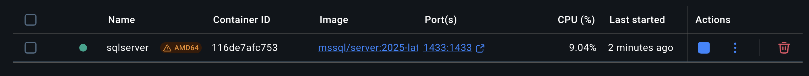


### Login / Register

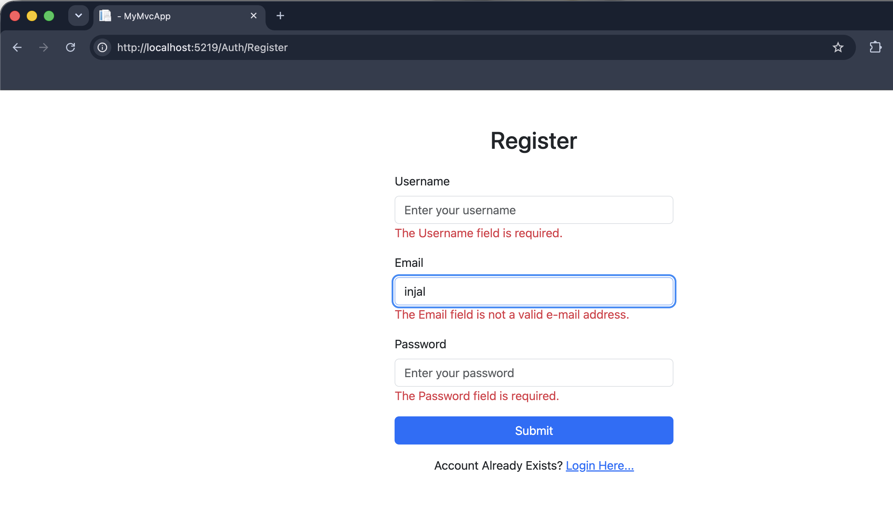
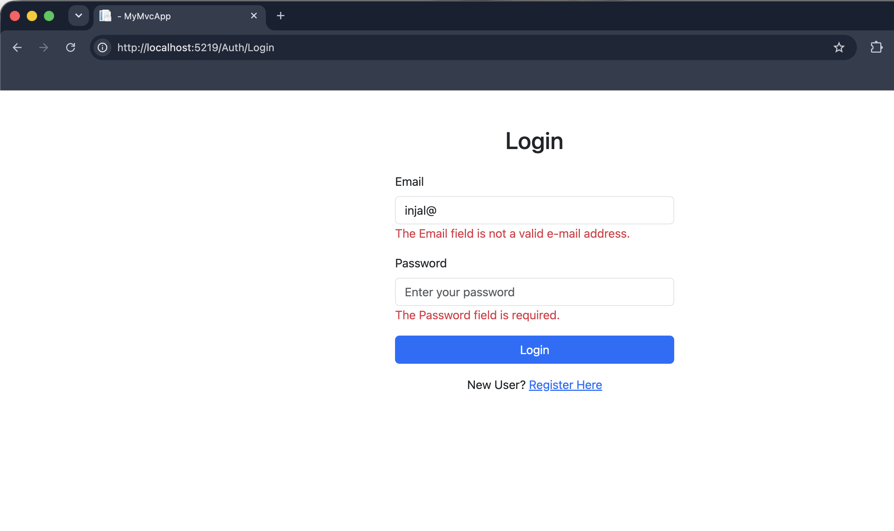


### Dashboard

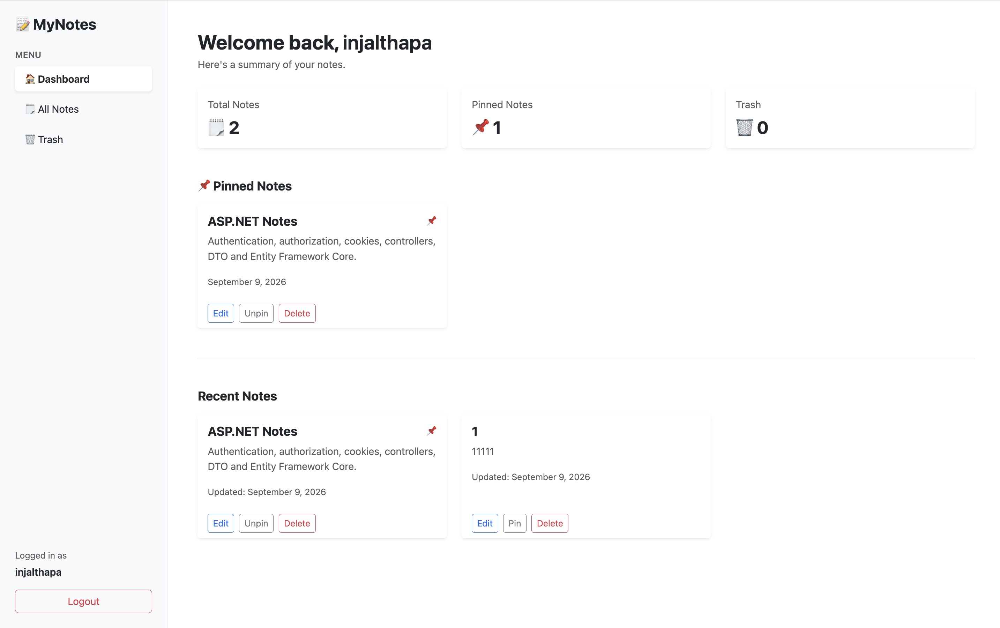


### All Notes

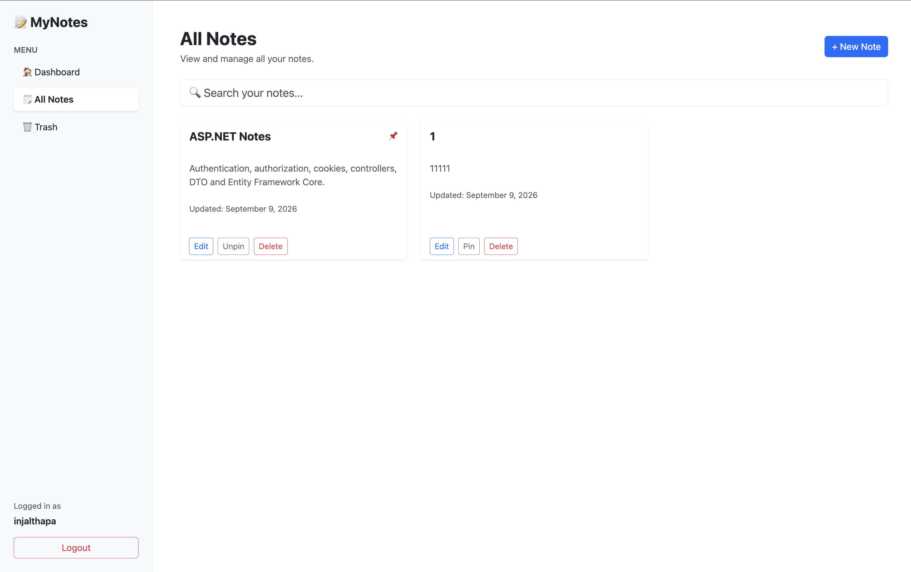


### Add New Note

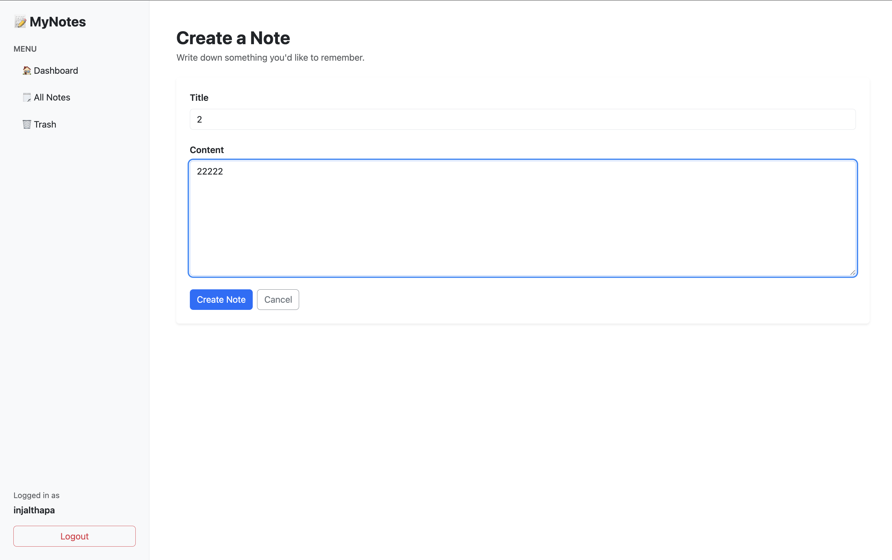


### Search Note

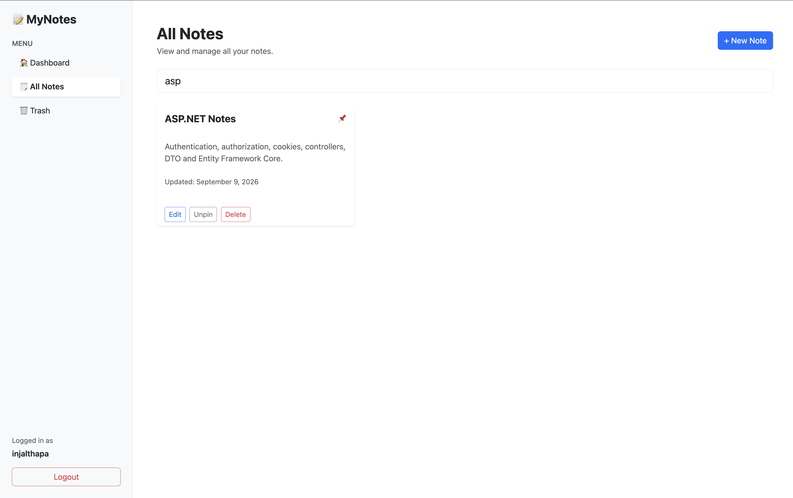


### Pin Note

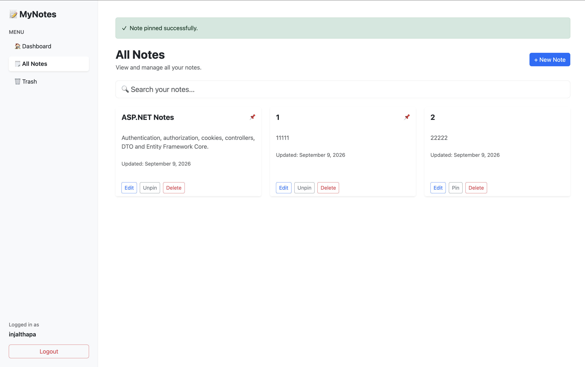


### Edit Note

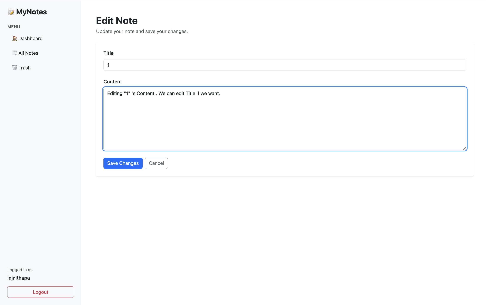


### Delete Note

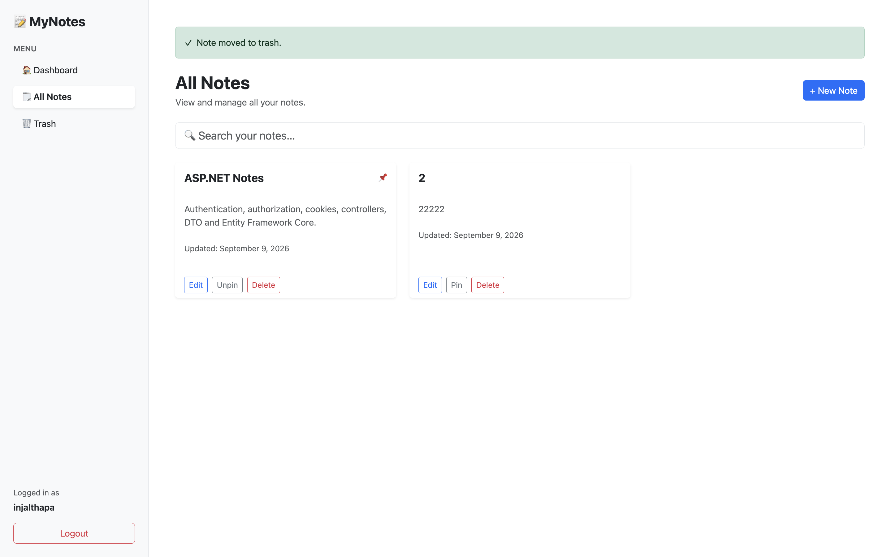


### Trash

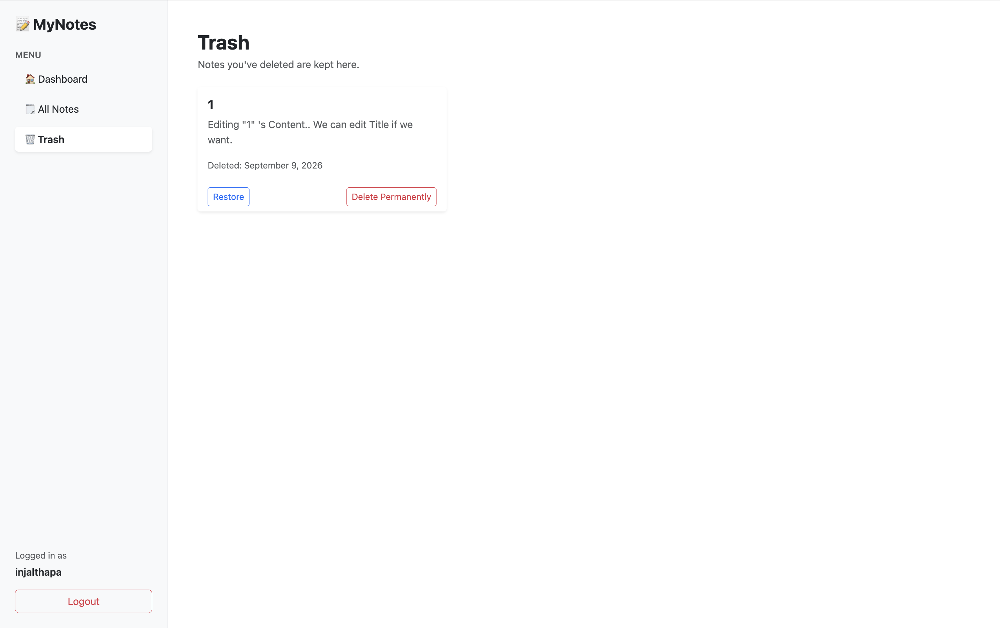


### Restore Note from Trash

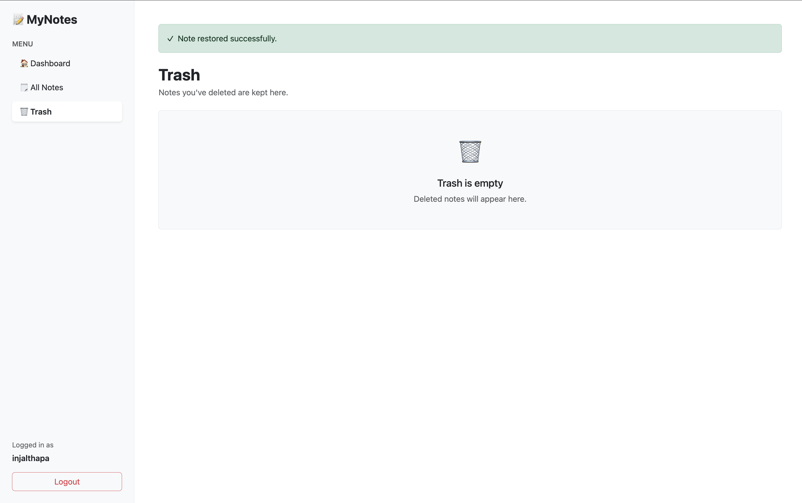


### Permanently Deleting Note from Trash

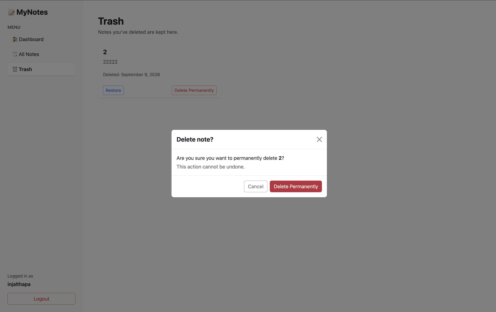